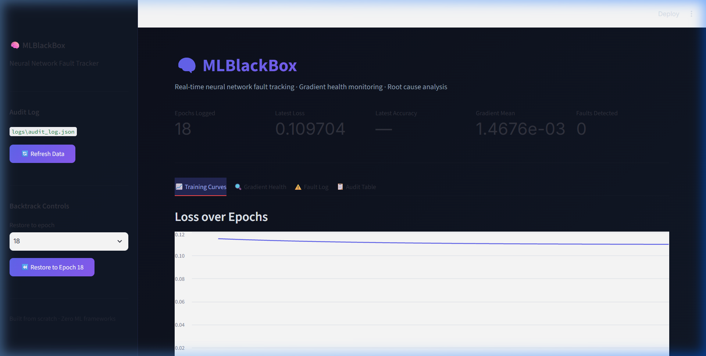

# MLBlackBox 🧠
> A "black box" flight recorder for PyTorch neural networks — monitors training in real time, detects what went wrong, rewinds to the last safe state, and tells you exactly how to fix it.



---

## Why This Project Exists

Training a neural network is easy. **Debugging one is not.**

When a model fails to converge, explodes with NaN values, or silently stagnates for hundreds of epochs, most tools give you nothing but a number: the loss. You're left guessing — *Was it the learning rate? An outlier batch? The wrong activation? A vanishing gradient from too many layers?*

**MLBlackBox was built to end that guesswork.**

It borrows the concept of an aviation black box — a system that records everything happening during a flight so that, when something goes wrong, investigators can replay exactly what happened and why. Applied to deep learning:

- Every epoch is recorded — loss, accuracy, gradient magnitudes, weight stats, timing
- Every anomaly is detected automatically — 5 distinct fault types, with adaptive thresholds
- When a fault occurs, the system rewinds the model to the last clean state and prints a plain-English report: *what happened, which layer caused it, and how to fix it*

No more staring at a diverging loss curve and wondering.

---

## What This Is

MLBlackBox is a **fault tracking and observability layer** that wraps around any standard PyTorch training loop. It has six components:

| Component | What it does |
|---|---|
| **Trainer** | Runs the PyTorch training loop, fires per-epoch callbacks |
| **Gradient Tracker** | Reads `param.grad` tensors to compute per-layer gradient stats |
| **Checkpoint Manager** | Saves a `.pt` model snapshot + `.json` metadata every epoch |
| **Metric Recorder** | Appends every epoch's metrics to a persistent `audit_log.json` |
| **Fault Detector** | Runs 5 adaptive detection algorithms after every epoch |
| **Backtracker** | On fault, rewinds model weights + generates a root cause report |

There is also a **Streamlit dashboard** that visualises the training curves, gradient health, fault log, and full audit table in real time.

### The Five Faults It Detects

| Fault | What triggers it | Common cause |
|---|---|---|
| 🔴 **Gradient Explosion** | Gradient > rolling mean + 3σ | High LR, unscaled inputs |
| 🟠 **Gradient Vanishing** | Gradient < 1e-6 for 20+ epochs | Sigmoid activations in deep nets |
| ⚫ **NaN / Inf Propagation** | Any NaN in loss, gradient, or weights | `log(0)` in BCE, numeric overflow |
| 🟡 **Loss Spike** | Loss jumps > 5× in one epoch | Outlier batch, LR too high |
| 🔵 **Training Stagnation** | Loss flat for 15+ epochs at high value | Saddle point, wrong architecture |

Detection uses **adaptive rolling statistics** — not fixed thresholds. A gradient of 50 is perfectly normal for some networks. The detector tracks the network's own historical mean and std and only flags genuine deviations.

---

## How to Use It

### 1. Install

```bash
pip install -r requirements.txt
```

Requirements: `torch`, `streamlit`, `pandas`

### 2. Wrap your PyTorch model

```python
import torch
import torch.nn as nn
import torch.optim as optim

from training.trainer import Trainer
from tracker.gradient_tracker import compute_gradient_stats, compute_weight_stats
from tracker.checkpoint import CheckpointManager
from tracker.metric_recorder import MetricRecorder
from tracker.fault_detector import FaultDetector
from tracker.backtracker import Backtracker
from tracker.report import print_report

# ── Step 1: Your normal PyTorch model ────────────────────────
net = nn.Sequential(
    nn.Linear(4, 8), nn.ReLU(),
    nn.Linear(8, 4), nn.ReLU(),
    nn.Linear(4, 1), nn.Sigmoid()
)
optimizer = optim.SGD(net.parameters(), lr=0.05)

# ── Step 2: Set up the tracker ───────────────────────────────
recorder   = MetricRecorder(log_path="logs/audit_log.json")
ckpt_mgr   = CheckpointManager(checkpoint_dir="checkpoints")
detector   = FaultDetector(recorder)
backtracker = Backtracker(ckpt_mgr, recorder)

detected_fault = None

# ── Step 3: Define an epoch callback ─────────────────────────
def on_epoch_end(record):
    global detected_fault

    grad_stats   = compute_gradient_stats(net)
    weight_stats = compute_weight_stats(net)

    # Log everything to audit_log.json
    epoch_rec = recorder.append(
        epoch=record.epoch,
        loss=record.loss,
        accuracy=record.accuracy,
        gradient_stats=grad_stats,
        weight_stats=weight_stats,
        learning_rate=record.learning_rate,
        epoch_time_ms=record.epoch_time_ms,
        batch_idx=record.batch_idx,
        nan_layer=record.nan_layer,
    )

    # Save a model checkpoint
    ckpt_mgr.save(net, record.epoch, record.loss,
                  record.accuracy, grad_stats)

    # Run fault detection (skip first 3 epochs — baseline needed)
    if record.epoch >= 3:
        fault = detector.check(epoch_rec)
        if fault:
            detected_fault = fault
            return True  # signals the trainer to stop

# ── Step 4: Train ─────────────────────────────────────────────
trainer = Trainer(net, nn.BCELoss(), optimizer, classification=True)
trainer.add_callback(on_epoch_end)
trainer.train(X_train, y_train, epochs=500)

# ── Step 5: Handle faults ─────────────────────────────────────
if detected_fault:
    result = backtracker.backtrack(detected_fault, net)
    print_report(result)
    # 'net' is now restored to its last clean checkpoint.
    # Adjust hyperparameters and call trainer.train() again.
```

### 3. Read the fault report

When a fault is caught, the backtracker prints a structured report:

```
============================================================
  MLBLACKBOX FAULT REPORT
============================================================

FAULT DETECTED
  Type:           GRADIENT_EXPLOSION
  Severity:       CRITICAL
  First appeared: Epoch 14
  Detected at:    Epoch 16

EVIDENCE:
  Loss:            0.34 (epoch 13) → 2847 (epoch 16)
  Gradient mean:   0.31 (epoch 13) → 847  (epoch 16)
  Fault layer:     Layer 2
  Causative batch: Batch index 47

ROOT CAUSE:
  Input features with large magnitude amplify gradients through the
  network. When a feature value is 1000× larger than the weight
  scale, the gradient for that weight becomes proportionally large.

SUGGESTED FIXES:
  1. Normalize inputs to [0, 1] using min-max scaling
  2. Standardize to mean=0, std=1 using z-score normalization
  3. Reduce learning rate by 10× (e.g., 0.01 → 0.001)
  4. Add gradient clipping (max abs value 1.0)
  5. Resume from the last clean checkpoint (already restored)

RESTORED STATE:
  Network weights restored to epoch 13 checkpoint.
  Ready to resume training with adjusted hyperparameters.
============================================================
```

### 4. Launch the dashboard

```bash
python -m streamlit run dashboard/app.py
```

Open `http://localhost:8501` to see:
- **Training Curves** — loss and accuracy over epochs
- **Gradient Health** — per-layer gradient mean/max, weight magnitudes
- **Fault Log** — all detected faults with severity and epoch
- **Audit Table** — full epoch-by-epoch record
- **Backtrack panel** — restore the model to any saved checkpoint

### 5. Run the built-in tests

```bash
# Test 1 — XOR convergence (validates the training loop)
python tests/test_xor.py

# Test 2 — Gradient explosion injection (validates fault detection)
python tests/test_fault_injection.py

# Test 3 — Vanishing gradient on deep sigmoid network
python tests/test_vanishing.py

# Test 4 — Iris dataset full integration run
python tests/test_iris.py
```

---

## Project Structure

```
MLBLACKBOX/
├── training/
│   └── trainer.py           # PyTorch training loop with callback hooks
├── tracker/
│   ├── gradient_tracker.py  # Per-layer gradient stats from param.grad
│   ├── checkpoint.py        # Save/load PyTorch state_dicts (.pt files)
│   ├── metric_recorder.py   # Audit log — appends every epoch to JSON
│   ├── fault_detector.py    # 5-fault adaptive detection engine
│   ├── backtracker.py       # Rewind weights + root cause analysis
│   └── report.py            # Plain-English fault report generator
├── dashboard/
│   └── app.py               # Streamlit real-time dashboard
├── data/
│   ├── xor_data.py          # XOR dataset helper
│   ├── iris_loader.py       # Iris CSV loader with normalization
│   └── iris.csv             # 150-sample Iris dataset
├── tests/
│   ├── test_xor.py              # Test 1: XOR convergence
│   ├── test_fault_injection.py  # Test 2: Gradient explosion injection
│   ├── test_vanishing.py        # Test 3: Deep sigmoid vanishing gradient
│   └── test_iris.py             # Test 4: Iris full integration run
├── checkpoints/             # Auto-created: checkpoint_epoch_NNN.pt + .json
├── logs/
│   └── audit_log.json       # Continuously appended training audit trail
├── assets/
│   └── dashboard_screenshot.png
└── requirements.txt         # torch, streamlit, pandas
```

---

## What Makes This Different

Tools like TensorBoard and Weights & Biases let you *visualise* what went wrong after training. MLBlackBox does something different — it **intervenes during training**, catches the fault the moment it appears, rewinds the model to before the fault occurred, and hands you back a working model with a diagnosis.

The combination of:
1. **Per-layer gradient tracking** — not just a global loss number
2. **Adaptive rolling thresholds** — calibrated to each network's own history
3. **Root cause library** — maps fault signatures to human explanations
4. **Automatic checkpoint rewind** — you get a usable model, not just an error message
5. **Plain-English fix recommendations** — actionable steps, not raw numbers

...makes it a tool you can actually use mid-experiment without stopping your workflow.
