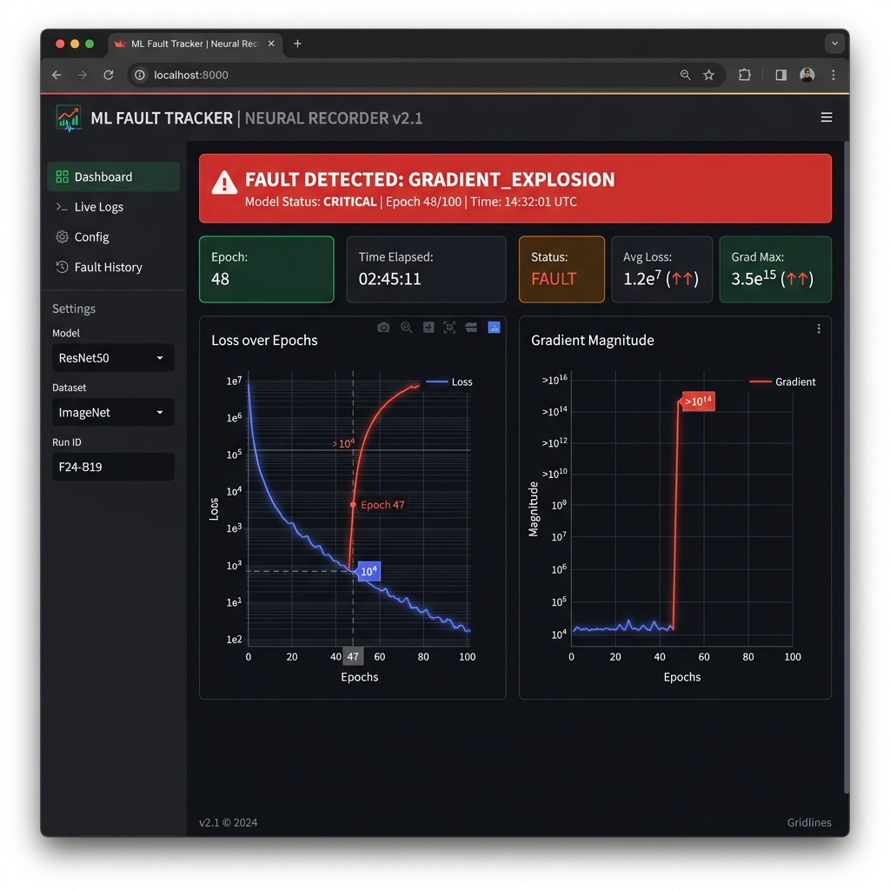

# MLBlackBox 🧠

> **"I built a system that watches a PyTorch neural network train in real time, detects when something goes wrong, rewinds to the last clean state, and tells you exactly why it broke and how to fix it."**

A production-grade fault tracking and observability system designed to act as a "black box" flight recorder for PyTorch models.

---

## What This Is

MLBlackBox wraps around your existing PyTorch training loop to provide:

- Real-time gradient health monitoring (per-layer, not just global)
- Five-fault adaptive detection engine
- Checkpoint system — complete `.pt` model snapshots at every epoch
- Backtracker — rewinds to the last clean state on fault detection
- Plain-English root cause analysis with concrete fix recommendations
- Streamlit dashboard for visualizing the "flight data"



---

## Project Structure

```
MLBLACKBOX/
├── training/
│   └── trainer.py         # PyTorch training loop with callback hooks
├── tracker/
│   ├── gradient_tracker.py  # PyTorch tensor gradient extraction
│   ├── checkpoint.py        # Save/load PyTorch state_dicts
│   ├── metric_recorder.py   # Audit log (flight data recorder)
│   ├── fault_detector.py    # 5-fault adaptive detection engine
│   ├── backtracker.py       # Rewind + root cause analysis
│   └── report.py            # Plain English report generator
├── dashboard/
│   └── app.py             # Streamlit dashboard
├── data/
│   ├── xor_data.py        # XOR test dataset
│   ├── iris_loader.py     # Iris CSV loader with normalization
│   └── iris.csv           # 150-sample Iris dataset
├── tests/
│   ├── test_xor.py            # Test 1: PyTorch XOR convergence
│   ├── test_fault_injection.py # Test 2: Gradient explosion injection
│   ├── test_vanishing.py      # Test 3: Deep sigmoid vanishing gradient
│   └── test_iris.py           # Test 4: Iris full run
├── checkpoints/           # Auto-created: checkpoint_epoch_NNN.pt
├── logs/
│   └── audit_log.json     # Continuously appended audit trail
└── requirements.txt       # torch, streamlit, pandas
```

---

## Quick Start

### 1. Install dependencies
```bash
pip install -r requirements.txt
```

### 2. Run the XOR test
```python
python tests/test_xor.py
```
Expected: PyTorch model converges (loss < 0.05).

### 3. Run the Iris full integration test
```python
python tests/test_iris.py
```
Expected: accuracy > 90%, audit log and `.pt` checkpoints created.

### 4. Run the fault injection test
```python
python tests/test_fault_injection.py
```
Injects extreme outlier values into one batch. Fault detector catches the explosion in the PyTorch tensors and backtracker generates a plain-English report.

### 5. Launch the Streamlit dashboard
```bash
streamlit run dashboard/app.py
```

---

## Using the System

### Train with full observability

```python
import torch
import torch.nn as nn
import torch.optim as optim
from training.trainer import Trainer
from tracker.gradient_tracker import compute_gradient_stats, compute_weight_stats
from tracker.checkpoint import CheckpointManager
from tracker.metric_recorder import MetricRecorder
from tracker.fault_detector import FaultDetector
from tracker.backtracker import Backtracker
from tracker.report import print_report

# 1. Build a standard PyTorch model
net = nn.Sequential(
    nn.Linear(4, 8), nn.ReLU(),
    nn.Linear(8, 4), nn.ReLU(),
    nn.Linear(4, 1), nn.Sigmoid()
)
optimizer = optim.SGD(net.parameters(), lr=0.05)

# 2. Set up MLBlackBox tracker components
recorder = MetricRecorder()
ckpt_mgr = CheckpointManager()
detector = FaultDetector(recorder)
backtracker = Backtracker(ckpt_mgr, recorder)

detected_fault = None

# 3. Create an epoch callback to hook into the training loop
def epoch_callback(record):
    global detected_fault
    
    grad_stats = compute_gradient_stats(net)
    weight_stats = compute_weight_stats(net)
    
    epoch_rec = recorder.append(
        epoch=record.epoch, loss=record.loss, accuracy=record.accuracy,
        gradient_stats=grad_stats, weight_stats=weight_stats,
        learning_rate=record.learning_rate, epoch_time_ms=record.epoch_time_ms,
        batch_idx=record.batch_idx, nan_layer=record.nan_layer,
    )
    ckpt_mgr.save(net, record.epoch, record.loss, record.accuracy,
                  grad_stats, batch_idx=record.batch_idx)
    
    if record.epoch >= 3:
        fault = detector.check(epoch_rec)
        if fault:
            detected_fault = fault
            return True  # Halt training

# 4. Run the Training loop
trainer = Trainer(net, nn.BCELoss(), optimizer, classification=True)
trainer.add_callback(epoch_callback)
trainer.train(X, y, epochs=500)

# 5. If fault detected, backtrack and print report
if detected_fault:
    result = backtracker.backtrack(detected_fault, net)
    print_report(result)
    # 'net' is now restored to the last clean checkpoint state!
```

---

## The Five Faults

| Fault | Detection Method | Typical Cause |
|-------|-----------------|---------------|
| **Gradient Explosion** | Current gradient > rolling_mean + 3σ | Unscaled inputs, high learning rate |
| **Gradient Vanishing** | Mean gradient < 1e-6 + no accuracy gain in 20 epochs | Sigmoid in hidden layers, deep networks |
| **NaN/Inf Propagation** | Any NaN in loss, gradients, or weights | Log(0) in BCE, overflow from explosion |
| **Loss Spike** | Loss > previous × 5× | Outlier batch, learning rate too high |
| **Training Stagnation** | Loss unchanged for 15 epochs at high value | Saddle point, wrong architecture |

### Adaptive Thresholds
Explosion detection uses **rolling statistics** — not fixed thresholds. A gradient of 50 might be normal for one network. The detector computes rolling mean and std over the last 10 epochs and flags only when current value is 3 standard deviations above the rolling mean.

---

## The Backtracker Report

When a fault is detected, the backtracker produces:

```
============================================================
  MLBLACKBOX FAULT REPORT
============================================================

FAULT DETECTED
  Type:          GRADIENT_EXPLOSION
  Severity:      CRITICAL
  First appeared: Epoch 14
  Detected at:   Epoch 16

EVIDENCE:
  Loss:               0.34 (epoch 13) → 2847 (epoch 16)
  Gradient mean:      0.31 (epoch 13) → 847 (epoch 16)
  Fault layer:        Layer 2
  Causative batch:    Batch index 47

ROOT CAUSE:
  Input features with large magnitude amplify gradients through the network.
  When a feature value is 1000× larger than the weight scale, the gradient
  for that weight becomes proportionally large.

SUGGESTED FIXES:
  1. Normalize input features to [0, 1] using min-max scaling
  2. Standardize features to mean=0, std=1 using z-score normalization
  3. Reduce learning rate by 10× (e.g., 0.01 → 0.001)
  4. Add gradient clipping: clip all gradients to max abs value of 1.0
  5. Resume training from the last clean checkpoint

RESTORED STATE:
  Network weights restored to epoch 13 checkpoint.
  Ready to resume training with adjusted hyperparameters.
============================================================
```

---

## 10-Week Build Timeline

| Week | Components Built | Milestone |
|------|-----------------|-----------|
| 1 | Neuron, Activations | Neuron forward pass verified |
| 2 | Layer, Network | Multi-layer forward pass |
| 3 | Loss, Backprop | Gradients flow correctly |
| 4 | Training Loop | XOR loss < 0.05 |
| 5 | Iris + Checkpoints | 10 epochs → 10 checkpoint files |
| 6 | Metric Recorder | Full audit_log.json |
| 7 | Fault Detection 1-3 | Explosion, Vanishing, NaN |
| 8 | Fault Detection 4-5 | Spike, Stagnation |
| 9 | Backtracker + Report | Full root cause report |
| 10 | Dashboard + Integration | End-to-end demo |

---

## What Makes This Different

Every individual component exists somewhere. Nobody has assembled all of it together in a single **lightweight, zero-dependency** system. The combination of:

1. **Per-layer gradient tracking** (not just global stats)
2. **Adaptive fault thresholds** that adjust to the network's own history
3. **Root cause analysis mapped to a cause library**
4. **Plain-English reports with ordered fix recommendations**
5. **Checkpoint rewind + resume** in a single pipeline

...is the original contribution. The system doesn't just detect that something went wrong — it explains *why*, identifies the *epoch and layer* where it started, and hands back a restored network ready to continue.
